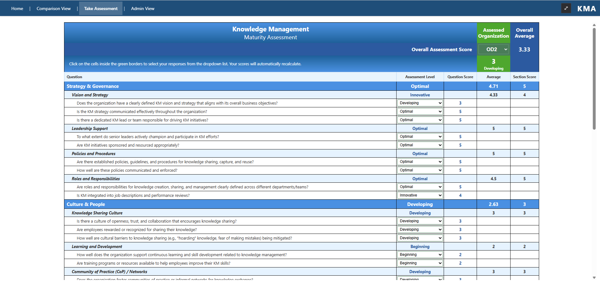
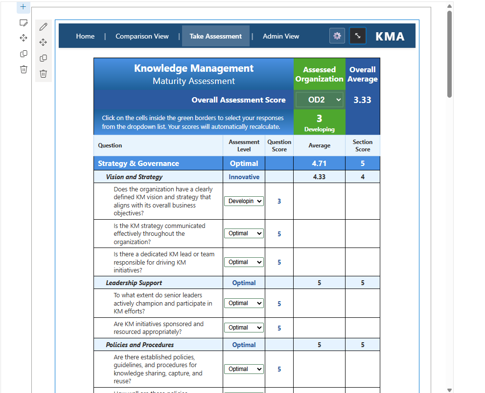
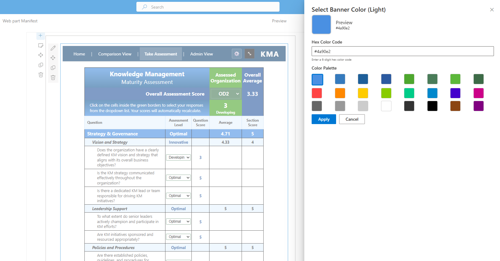
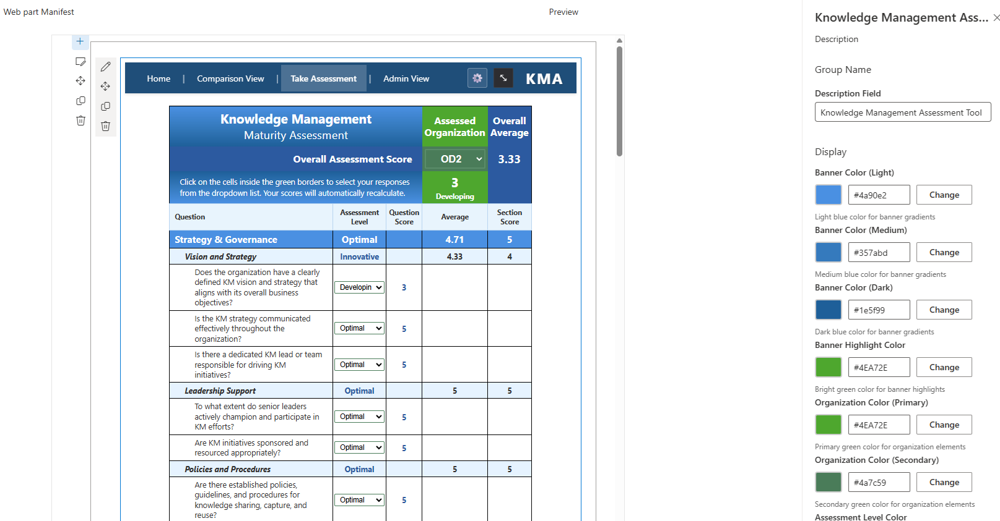

# Knowledge Management Maturity Assessment (KMA)

A SharePoint Framework (SPFx) web part for conducting comprehensive knowledge management maturity assessments within organizations.


## Overview

The KMA web part provides an interactive assessment tool that helps organizations evaluate their knowledge management practices across multiple dimensions. The assessment generates scores and provides insights into areas for improvement in knowledge management strategies.


*Main assessment interface with dynamic scoring and section rollups*

## Features

### Assessment Capabilities
- **Multi-section Assessment**: Covers Strategy & Governance, Leadership Support, Policies & Procedures, and Roles & Responsibilities
- **Dynamic Scoring**: Real-time calculation of section scores and overall assessment scores
- **Assessment Levels**: Five-point scale from Insufficient to Optimal
- **Organization Selection**: Dropdown for selecting assessed organization
- **Score Rollups**: Automatic calculation of section averages and overall scores

### User Experience
- **Responsive Design**: Optimized for various screen sizes and devices
- **Fullscreen Mode**: Dedicated fullscreen view for focused assessment completion
- **Admin Controls**: Security-trimmed toolbar for users with administrative permissions
- **Customizable Styling**: Extensive theming options through web part properties


*Compact view showing responsive design and section organization*

### Customization Options
- **Color Theming**: Customizable colors for banners, organization elements, assessment levels, and subheadings
- **Typography**: Configurable font families and sizes for different text elements
- **Layout Options**: Flexible styling to match organizational branding


*Advanced color picker controls for complete theming customization*

## Applies to

- [SharePoint Framework](https://aka.ms/spfx)
- [Microsoft 365 tenant](https://docs.microsoft.com/en-us/sharepoint/dev/spfx/set-up-your-developer-tenant)
- SharePoint Online
- SharePoint Server 2019+

## Prerequisites

- Node.js 16.x or 18.x
- SPFx 1.18+
- Modern SharePoint pages

## Solution

| Solution | Author(s) |
| -------- | --------- |
| KMA      | nmoutdoors |

## Version History

| Version | Date | Comments |
| ------- | ---- | -------- |
| 0.0.1   | January 29, 2025 | Initial release with assessment form, dynamic scoring, and customizable theming |

## Installation

### Development Setup

1. **Clone the repository**:
   ```bash
   git clone https://github.com/nmoutdoors/KMA.git
   cd KMA
   ```

2. **Install dependencies**:
   ```bash
   npm install
   ```

3. **Build the solution**:
   ```bash
   gulp build
   ```

4. **Start development server**:
   ```bash
   gulp serve
   ```

### Deployment to SharePoint

1. **Bundle for production**:
   ```bash
   gulp bundle --ship
   ```

2. **Package the solution**:
   ```bash
   gulp package-solution --ship
   ```

3. **Deploy**:
   - Upload the `.sppkg` file from `sharepoint/solution/` to your SharePoint App Catalog
   - Add the web part to a SharePoint page

## Configuration

### Web Part Properties

Access customization options through the web part property pane:


*Comprehensive theming options in the property pane*

#### Display Colors
- Banner colors (light, medium, dark gradients)
- Banner highlight color
- Organization colors (primary, secondary)
- Assessment level color
- Question score color
- Subheading background color

#### Typography
- Primary font family
- Base font size
- Title font size
- Section header font size

### Security
- **View Access**: All users can view and complete assessments
- **Admin Access**: Users with page edit permissions see additional toolbar options (fullscreen, settings)

## Usage

1. Add the KMA web part to a SharePoint page
2. Configure styling and branding through the property pane
3. Users select their organization from the dropdown
4. Complete the assessment by selecting appropriate levels for each question
5. View real-time score calculations and section rollups
6. Use fullscreen mode for focused assessment completion

## Technical Architecture

### Built With
- **SharePoint Framework (SPFx) 1.20.0**: Modern SharePoint development framework
- **React 18.x**: Component-based UI library
- **TypeScript 4.7**: Type-safe JavaScript development
- **SCSS**: Advanced CSS preprocessing with modular styles

### Project Structure
```
KMA/
├── src/
│   └── webparts/
│       └── kma/
│           ├── components/          # React components
│           │   ├── Kma.tsx         # Root component
│           │   ├── AssessmentForm.tsx # Main assessment interface
│           │   └── *.module.scss   # Component styles
│           ├── propertyPane/        # Custom property pane controls
│           │   ├── PropertyPaneColorPicker.tsx
│           │   └── PropertyPaneFontPickers.tsx
│           └── loc/                 # Localization resources
├── config/                          # SPFx configuration
├── sharepoint/                      # SharePoint package assets
└── teams/                          # Microsoft Teams manifest
```

### Key Components
- **KmaWebPart.ts**: Main web part class with property definitions and lifecycle management
- **Kma.tsx**: Root React component handling layout and admin features
- **AssessmentForm.tsx**: Core assessment interface with dynamic scoring
- **Custom Property Pane Controls**: Color pickers and font selectors for theming

## Development

### Available Scripts

```bash
# Development build
gulp build

# Production build
gulp bundle --ship

# Package for deployment
gulp package-solution --ship

# Development server
gulp serve

# Code linting
gulp lint

# Clean build artifacts
gulp clean
```

### Development Guidelines

- Follow TypeScript best practices
- Use React functional components with hooks
- Implement responsive design principles
- Maintain accessibility standards
- Write modular, reusable SCSS

## Roadmap

- [ ] **Data Integration**: Connect to SharePoint lists or external data sources
- [ ] **Export Functionality**: PDF and Excel export capabilities
- [ ] **Historical Tracking**: Assessment history and progress tracking
- [ ] **Advanced Analytics**: Reporting dashboard and trend analysis
- [ ] **Multi-language Support**: Internationalization and localization
- [ ] **Microsoft Graph Integration**: Enhanced user and organizational data

## Contributing

1. Fork the repository
2. Create a feature branch (`git checkout -b feature/amazing-feature`)
3. Commit your changes (`git commit -m 'Add amazing feature'`)
4. Push to the branch (`git push origin feature/amazing-feature`)
5. Open a Pull Request

## License

This project is licensed under the MIT License - see the [LICENSE](LICENSE) file for details.

## Support

For questions, issues, or feature requests, please create an issue in the GitHub repository.

## References

- [SharePoint Framework Documentation](https://docs.microsoft.com/en-us/sharepoint/dev/spfx/sharepoint-framework-overview)
- [React Documentation](https://reactjs.org/docs/getting-started.html)
- [TypeScript Documentation](https://www.typescriptlang.org/docs/)
- [Microsoft 365 Patterns and Practices](https://aka.ms/m365pnp)

## Disclaimer

**THIS CODE IS PROVIDED _AS IS_ WITHOUT WARRANTY OF ANY KIND, EITHER EXPRESS OR IMPLIED, INCLUDING ANY IMPLIED WARRANTIES OF FITNESS FOR A PARTICULAR PURPOSE, MERCHANTABILITY, OR NON-INFRINGEMENT.**